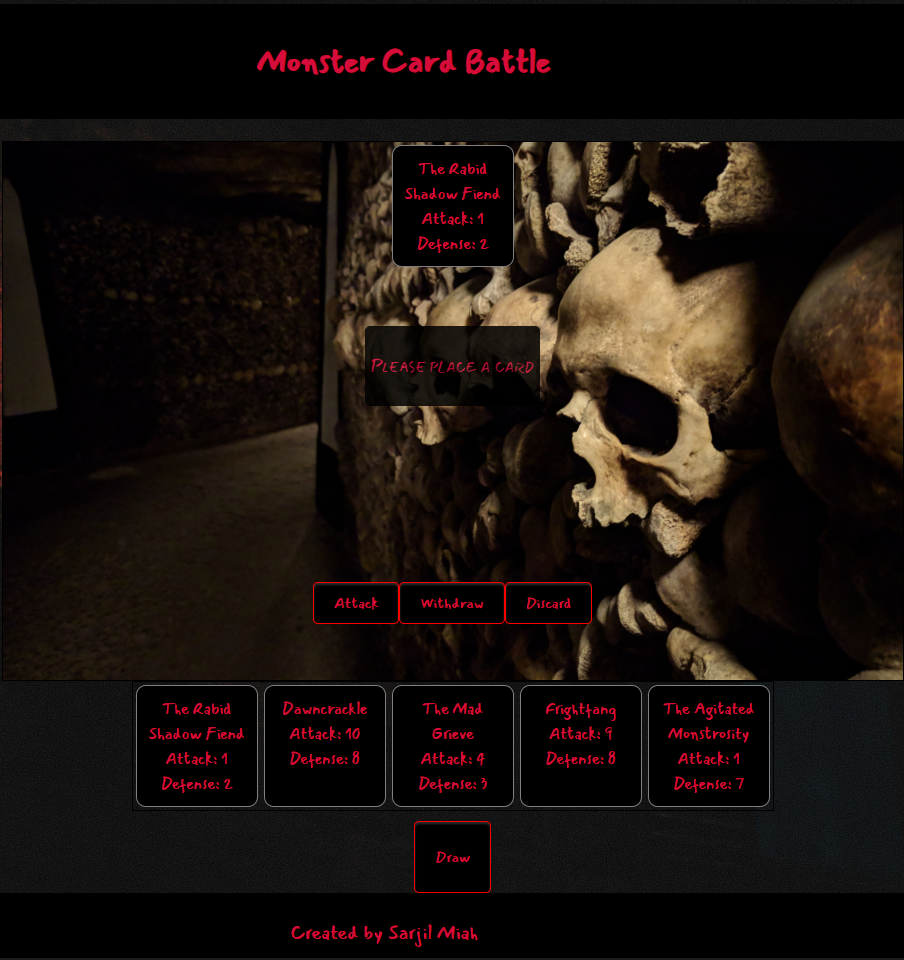

# CardBattle

### Technologies
* JavaScript

### Overview
Monster Card Battle is card game created using pure JavaScript where the player battles against an AI to deplete their HP (health points). 

[Live Site](https://sarjil.github.io/CardBattle/)

 

## Functionality & MVP
* Game Board
  * Design the game board, instructions, and plan game logic
* Create Database of Cards 
  * Create a deck of 60 cards, consisting of 20 unique monsters
* Create Game Logic
  * Draw cards, shuffle, withdraw, discard, attack, and update HP. 
* Add styling


```JavaScript
    attackBtn.addEventListener('click', function () {
            oppMonsters = document.querySelectorAll('.opp-monster');
            oppMonsters.forEach(monster => {
            if (userCards.childElementCount === 1) {
                let userAtk = userCards.firstElementChild.getAttribute.Attack
                let userDfn = userCards.firstElementChild.getAttribute.Defense
                let enemyAtk = enemyCards.firstElementChild.getAttribute.Attack
                let enemyDfn = enemyCards.firstElementChild.getAttribute.Defense
                
                if(userAtk >= enemyDfn){
                    that.oppHP -= (userAtk - enemyDfn); 
                    enemyDiscard.appendChild(monster);
                    that.opponentDraw();
                }else if(enemyAtk > userDfn) {
                    that.hp -= (enemyAtk - userDfn); 
                }
                that.updateHP();
                
            } else {
                board.innerHTML= `<p> Must place a card in order to Attack! </p>`
            }
            });
        })
        
```
This attack event listener ensures the logic and calculations behind the user attacking the opponent. The users attack power (AP) must be more than the opponents defense power (DP). 
If successful, the difference between the users AP and opponents DP will be deducted from the opponents HP. On the other hand, if the opponents DP is more than the users AP,
and the opponents AP is more than the users DP, then the difference between the enemys AP and users DP will be deducted from the users HP.


```JavaScript
    getDeck() {
      let deck = this.deck;

      for (let i = 0; i < this.monsters.length; i++) {
              let x = Math.floor((Math.random() * this.points.length));
              let y = Math.floor((Math.random() * (this.points.length - 1))); 
                //makes sure the monsters defense will never be 10. If defense is 
                //10, it will be unbeatable.
              let card = { Monster: this.monsters[i], Attack: this.points[x], Defense: this.points[y] };
              deck.push(card);
              deck.push(card);
              deck.push(card);
       }
     
     return deck;
    }

```
This function generates the deck for the game. It iterates through the array of monsters, assigns a random Attack and Defense, and pushes three copies of the card into the deck. Each new game will ensure no monster will have the same stats from the previous game.

```JavaScript
    shuffle() {
     let deck = this.deck;
     for (let i = 0; i < 1000; i++) {
        let location1 = Math.floor((Math.random() * deck.length));
        let location2 = Math.floor((Math.random() * deck.length));
        let temp = deck[location1];

        deck[location1] = deck[location2];
        deck[location2] = temp;
     }
   }
```

The shuffle function swaps two random cards 1000 times, ensuring a uniquely shuffled deck every game. 

